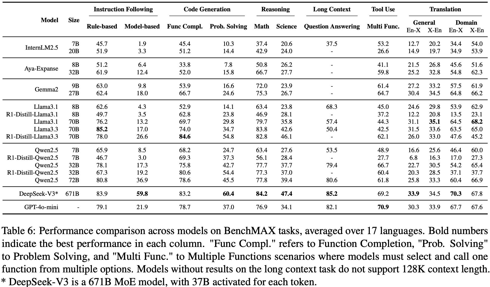
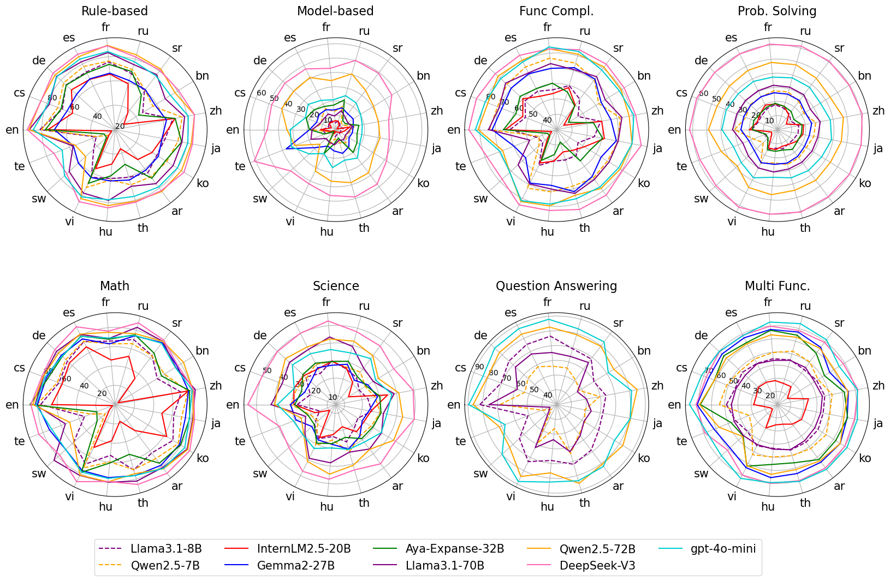

# BenchMAX: A Comprehensive Multilingual Evaluation Suite for Large Language Models

[**HuggingFace**](https://huggingface.co/collections/LLaMAX/benchmax-674d7a815a57baf97b5539f4) | [**Arxiv**](https://arxiv.org/pdf/2502.07346) | [**Citation**](#citation)

BenchMAX is a comprehensive, high-quality, and multiway parallel multilingual benchmark
comprising 10 tasks designed to assess crucial capabilities across 17 diverse language.

## News
**🔥[Apr 22, 2025] Update the results of DeepSeek-R1-Distill Models**

[Feb 12, 2025] Released the multilingual benchmark

## Dataset Download
We evaluate multiple crucial capabilities of large language models(LLMs) in multilingual scenarios. The dataset links are as follows:

| Dataset                      | Evaluated Capability   | HuggingFace Dataset Path                                                                            |
|------------------------------|------------------------|-----------------------------------------------------------------------------------------------------|
| BenchMAX_Rule-based          | Instruction following  | [🤗 BenchMAX_Rule-based](https://huggingface.co/datasets/LLaMAX/BenchMAX_Rule-based)                   |
| BenchMAX_Model-based         | Instruction following  | [🤗 BenchMAX_Model-based](https://huggingface.co/datasets/LLaMAX/BenchMAX_Model-based)                 |
| BenchMAX_Function_Completion | Code generation        | [🤗 BenchMAX_Function_Completion](https://huggingface.co/datasets/LLaMAX/BenchMAX_Function_Completion) |
| BenchMAX_Problem_Solving     | Code generation        | [🤗 BenchMAX_Problem_Solving](https://huggingface.co/datasets/LLaMAX/BenchMAX_Problem_Solving)         |
| BenchMAX_Math                | Reasoning              | [🤗 BenchMAX_Math](https://huggingface.co/datasets/LLaMAX/BenchMAX_Math)                               |
| BenchMAX_Science             | Reasoning              | [🤗 BenchMAX_Science](https://huggingface.co/datasets/LLaMAX/BenchMAX_Science)                         |
| BenchMAX_Question_Answering  | Long context modelling | [🤗 BenchMAX_Question_Answering](https://huggingface.co/datasets/LLaMAX/BenchMAX_Question_Answering)   |
| BenchMAX_Multiple_Functions  | Tool use               | [🤗 BenchMAX_Multiple_Functions](https://huggingface.co/datasets/LLaMAX/BenchMAX_Multiple_Functions)   |
| BenchMAX_General_Translation | Translation            | [🤗 BenchMAX_General_Translation](https://huggingface.co/datasets/LLaMAX/BenchMAX_General_Translation) |
| BenchMAX_Domain_Translation  | Translation            | [🤗 BenchMAX_Domain_Translation](https://huggingface.co/datasets/LLaMAX/BenchMAX_Domain_Translation)   |

## Results
We evaluate common multilingual large language models as shown in the following table.
The results are averaged across 17 languages.
Note: Although DeepSeek-V3 supports 128 context length, its API only supports 64K context length, and we cannot deploy it on our server. Therefore, we have not evaluated its long-context capabilities yet.



The detailed results for each language are illustrated in the figure below.



## Supported Languages
Arabic, Bengali, Chinese, Czech, English, French, German, Hungarian, Japanese, Korean, Serbian, Spanish, Swahili, Telugu, Thai, Russian, Vietnamese

## Installation
You can clone this repository and install dependencies using the following commands:

```bash
git clone --recurse-submodules https://github.com/CONE-MT/BenchMAX.git
cd BenchMAX
pip install -r requirements.txt
```

## Evaluation

You can simply use the script `run.sh` to evaluate one model on one task.

```bash
./run.sh <model> <task> <languages> [additional arguments]
```

Examples:

```bash
./run.sh meta-llama/Llama-3.1-8B-Instruct rule_based en
./run.sh /path/to/your/local/model xgpqa all # "all" means all 17 languages
./run.sh meta-llama/Llama-3.1-8B-Instruct problem-solving all /path/to/your/local/model # The fourth argument for the problem-solving task is specified as the local model path
```

The translation tasks are not supported in `run.sh`. Please see the commands in [Translation Tasks](#translation-tasks) section.

For more details on how to run each task and customize the arguments, see the following sections:
- [Rule-based Instruction Following Task](#rule-based-instruction-following-task)
- [Model-based Instruction Following Task](#model-based-instruction-following-task)
- [Function Completion Task](#function-completion-task)
- [Programming Problem Solving Task](#programming-problem-solving-task)
- [Math Reasoning Task](#math-reasoning-task)
- [Science Reasoning Task](#science-reasoning-task)
- [Long Context Task](#long-context-task)
- [Tool Use Task](#tool-use-task)
- [Translation Tasks](#translation-tasks)


### Rule-based Instruction Following Task
We employ [lm-evaluation-harness](https://github.com/EleutherAI/lm-evaluation-harness) to run this task. First clone its repository and install the lm-eval package:

```bash
git clone --depth 1 https://github.com/EleutherAI/lm-evaluation-harness
cd lm-evaluation-harness
pip install -e .
```

Run the `lm-eval` command to evaluate models. We recommend to use `vllm` for faster inference speed.
For more command options, please refer to [lm-evaluation-harness](https://github.com/EleutherAI/lm-evaluation-harness).

```bash
cd BenchMAX
# Evaluate on all 17 languages
lm-eval -m vllm --model_args pretrained=${model} --tasks xifeval_multi --batch_size auto --apply_chat_template --include_path tasks/ifeval --log_samples -o results

# Evaluate on one specific language
lm-eval -m vllm --model_args pretrained=${model} --tasks xifeval_zh --batch_size auto --apply_chat_template --include_path tasks/ifeval --log_samples -o results
```

### Model-based Instruction Following Task
We use the official repository of [Arena-hard](https://github.com/lmarena/arena-hard-auto) to run this task. 
Please run the following script to prepare the code and data.

```bash
cd BenchMAX/tasks/arenahard
bash prepare.sh
```

Then modify the model configs in `arena-hard-auto/config`.
Please add your model config to `api_config.yaml` and add your model name to the model list in other config like `gen_answer_config_*.yaml` and `judge_config_*.yaml`.

Finally, deploy your model and run the evaluation, where your model first generates responses to prompts and GPT-4o-mini judge them against GPT-4o responses, as we do in the paper.

```bash
# serve your model by vllm
vllm serve meta-llama/Llama-3.1-8B-Instruct

# generate responses
cd arena-hard-auto
languages=(en ar bn cs de es fr hu ja ko ru sr sw te th vi zh)
for lang in "${languages[@]}"; do
    python gen_answer.py --setting-file config/gen_answer_config_${lang}.yaml
done

# run LLM-as-a-judge
export OPENAI_API_KEY=...
for lang in "${languages[@]}"; do
    python gen_judgment.py --setting-file config/judge_config_${lang}.yaml
done
```

### Function Completion Task
We use the [evalplus](https://github.com/evalplus/evalplus) package to evaluate the models.

```bash
cd BenchMAX/tasks/evalplus

languages=(en ar bn cs de es fr hu ja ko ru sr sw te th vi zh)
for lang in "${languages[@]}"; do
    python -m evalplus.evaluate --model meta-llama/Llama-3.1-8B-Instruct --dataset humaneval --backend vllm --greedy --lang ${lang}
done
```

### Programming Problem Solving Task
We use the [LiveCodeBench](https://github.com/LiveCodeBench/LiveCodeBench) package to run this task.

```bash
cd BenchMAX/tasks/LiveCodeBench

languages=(en ar bn cs de es fr hu ja ko ru sr sw te th vi zh)
for lang in "${languages[@]}"; do
    python -m lcb_runner.runner.main --model meta-llama/Llama-3.1-8B-Instruct --local_model_path $local_model_path --release_version release_v4 --dataset $lang --evaluate --num_process_evaluate 16
done
```

### Math Reasoning Task
We employ [lm-evaluation-harness](https://github.com/EleutherAI/lm-evaluation-harness) to run this task.
The installation process is same as above.

```bash
cd BenchMAX

lm-eval -m vllm --model_args pretrained=${model} --tasks xmgsm_native_cot_multi --batch_size auto --apply_chat_template --include_path tasks/mgsm --log_samples -o results
```

### Science Reasoning Task
We also employ [lm-evaluation-harness](https://github.com/EleutherAI/lm-evaluation-harness) to run this task.

```bash
cd BenchMAX

lm-eval -m vllm --model_args pretrained=${model} --tasks xgpqa_main_native_cot_zeroshot_multi --batch_size auto --apply_chat_template --include_path tasks/gpqa --log_samples -o results
```

### Long Context Task
We adopt the [RULER](https://github.com/NVIDIA/RULER) repository and add QA-in-a-Haytack task.

First, download the data and models from the web.

```bash
cd BenchMAX/tasks/RULER/scripts

cd data/synthetic/json
bash download_haystack.sh
bash download_qa_dataset.sh
```

Then, configure your model information in `config_models.sh` and `run.sh`, referring to [RULER's guide](https://github.com/NVIDIA/RULER#3-run-evaluation-pipeline).
You can change the context length in `config_models.sh`.

Finally, run the evaluation pipeline.

```bash
cd BenchMAX/tasks/RULER/scripts

languages=(en ar bn cs de es fr hu ja ko ru sr sw te th vi zh)
for lang in "${languages[@]}"; do
    bash run.sh YOUR_MODEL_NAME synthetic $lang
done
```

### Tool Use Task
We modify the code from the [NexusRaven](https://github.com/nexusflowai/NexusRaven) repo.
Simply run the following command.

```bash
cd BenchMAX/tasks/nexus

languages=(en ar bn cs de es fr hu ja ko ru sr sw te th vi zh)
for lang in "${languages[@]}"; do
    python evaluator.py -m ${model} --infer-backend vllm -t ${lang} --output-parser-name generic
done
```

Note that some models that support calling tools need specific output parsers.
For example, for llama3 models, `--output-parser-name` should be set to `llama3`.

### Translation Tasks
Run the following commands to generate translations and evaluate translations.
Metrics now include spBLEU, BLEU, TER, and xCOMET.

```bash
cd BenchMAX/tasks/translation

# generate general translations
# -s denotes source languages, -t denotes target languages
python generate_translation.py -s en -t zh,es,fr,de,ru,ja,th,sw,bn,te,ar,ko,vi,cs,hu,sr --task-name flores --model-name $model --infer-backend vllm --max-tokens 512
python generate_translation.py -s zh,es,fr,de,ru,ja,th,sw,bn,te,ar,ko,vi,cs,hu,sr -t en --task-name flores --model-name $model --infer-backend vllm --max-tokens 512
python generate_translation.py -s en -t zh,es,fr,de,ru,ja,th,bn,ar,ko,vi,cs,hu,sr --task-name ted --model-name $model --infer-backend vllm --max-tokens 512
python generate_translation.py -s zh,es,fr,de,ru,ja,th,bn,ar,ko,vi,cs,hu,sr -t en --task-name ted --model-name $model --infer-backend vllm --max-tokens 512
python generate_translation.py -s en -t cs,de,es,ja,ru,zh --task-name wmt24 --model-name $model --infer-backend vllm --max-tokens 1024

# evaluate general translations
python evaluate_translation.py -s en -t zh,es,fr,de,ru,ja,th,sw,bn,te,ar,ko,vi,cs,hu,sr --task-name flores --model-name $model --metrics spBLEU
python evaluate_translation.py -s zh,es,fr,de,ru,ja,th,sw,bn,te,ar,ko,vi,cs,hu,sr -t en --task-name flores --model-name $model --metrics spBLEU
python evaluate_translation.py -s en -t zh,es,fr,de,ru,ja,th,bn,ar,ko,vi,cs,hu,sr --task-name ted --model-name $model --metrics spBLEU
python evaluate_translation.py -s zh,es,fr,de,ru,ja,th,bn,ar,ko,vi,cs,hu,sr -t en --task-name ted --model-name $model --metrics spBLEU
python evaluate_translation.py -s en -t cs,de,es,ja,ru,zh --task-name wmt24 --model-name $model --metrics spBLEU

# generate and evaluate domain translations
tasks=("ifeval" "gpqa" "lcb_v4" "mgsm" "humaneval" "nexus" "arenahard")
max_tokens_list=(512 3072 2048 1024 1024 512 3072)
for i in "${!tasks[@]}"; do
    task=${tasks[$i]}
    max_tokens=${max_tokens_list[$i]}
    python generate_translation.py -s en -t zh,es,fr,de,ru,ja,th,sw,bn,te,ar,ko,vi,cs,hu,sr --task-name $task --model-name $model --infer-backend vllm --max-tokens $max_tokens
    python generate_translation.py -s zh,es,fr,de,ru,ja,th,sw,bn,te,ar,ko,vi,cs,hu,sr -t en --task-name $task --model-name $model --infer-backend vllm --max-tokens $max_tokens

    python evaluate_translation.py -s en -t zh,es,fr,de,ru,ja,th,sw,bn,te,ar,ko,vi,cs,hu,sr --task-name $task --model-name $model --metrics spBLEU
    python evaluate_translation.py -s zh,es,fr,de,ru,ja,th,sw,bn,te,ar,ko,vi,cs,hu,sr -t en --task-name $task --model-name $model --metrics spBLEU
done
```

## Citation
If our dataset helps your work, please cite this paper:
```
@article{huang2025benchmax,
  title={BenchMAX: A Comprehensive Multilingual Evaluation Suite for Large Language Models},
  author={Huang, Xu and Zhu, Wenhao and Hu, Hanxu and He, Conghui and Li, Lei and Huang, Shujian and Yuan, Fei},
  journal={arXiv preprint arXiv:2502.07346},
  year={2025}
}
```
